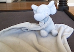
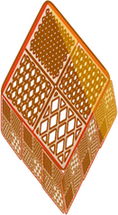

# Key Story

<b>ramacsv,My Friend SuiteCase </b>

## Welcome to my page

_Suitecase lives in the cloud island in the sky._

## The Floor Hole Mystery

_In New York Suitecase was staying in a hotel._

_He was bored and nothing do_

_Thought of drilling a hole in the ground to if there is anything he can find_

_He drilled a very deep hole in the floor._

_Then he got down into the hole and landed on a brick surface_

_There was an unusual kind of brick._

<b>Drawing by ramacsv, SuiteCase Friend</b>

_It looked interesting so brought it to his room._

_He found a note on it, it said this a box and is locked, there is no key hole but there is a key._

_He went again in the hole and see what else he can find._

_He saw a diamond shaped( rhombus) box._

<b>Drawing by ramacsv, SuiteCase Friend</b>

_That box started floating and went into his room_

_He followed the box._

_When he touched, it opened._

_Inside there was a key and a light on it._

<b>Drawing by ramacsv, SuiteCase Friend</b>

_He did not know what that light is for._

_He decided to go down where the brick box was_.     

_He turned the light on and by chance the beam of light fell on the brick box._

_surprise! He saw the key hole_

_He put the key in and it and it opened_

_There was some writing and it said There is something hidden in the real bottom that you need to access_

_Now he has new problem of how to access the real bottom_

_Near by the brick box he saw some thing shiny_

_He went and dug it up and found another key_

_He took that key and went near the brick box_

_He turned the box upside down and there was a hole and used the key to open_

_Lo behold!! It opened_

_There was a pen, pencil and a board_

_A key appeared on it and Suitecase picked it up._

_मन नाम राम सि येस् वि ।     अहं सूट्केसस् सख अस्मि ।_

_When he took the key diamond shaped box closed_

_By chance the light fell on the brick box and a keyhole appeared he put the key in the keyhole_ 

_it opened the real bottom and in it there he found a frame, a picture,  and a notebook._ 

_He finished decorating the picture put it in the frame._

_The note book had a pen inside._

_With a pen he drew a picture of a train because he thought it would aniamte and move around_

_But it turned into a giant train on a mountain_

_Every time he wrote a picture it turned out to be on a mountain_

## The End

